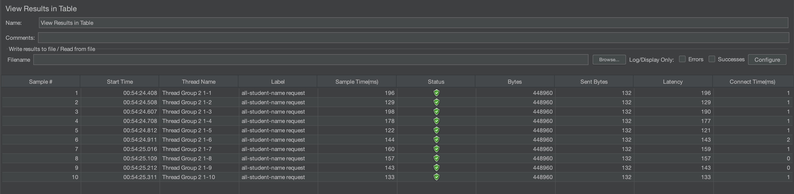
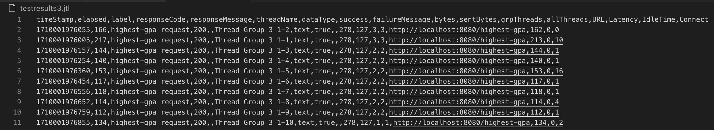

# Modul 5: Java Profiling
### Tutorial Advanced Programming 2023/2024 Genap

- Nama    : Akmal Ramadhan 
- NPM     : 2206081534
- Kelas   : Pemrograman Lanjut A

## Reflection
### Perbedaan JMeter dan Intellij Profiler
Perbedaan pendekatan _performance testing_ dengan JMeter dan _profiling_ dengan Intellij Profiler
dalam konteks optimisasi performa aplikasi yaitu:
- **JMeter** digunakan untuk mengukur performa aplikasi dengan cara mensimulasikan beban kerja yang tinggi
  pada aplikasi (aplikasi digunakan oleh banyak orang pada saat yang bersamaan), sedangkan
- **Intellij Profiler** digunakan untuk mencari tahu _bottleneck_ pada aplikasi yang menyebabkan
  performa aplikasi menjadi buruk atau lambat.

### Proses _Profiling_
Proses _profiling_ sangat berguna untuk menemukan _bottleneck_ pada aplikasi yang menyebabkan performa 
aplikasi menjadi lambat. Selama proses ini, _profiler_ akan mengumpulkan data dan menganalisis bagian-bagian
yang menjadi _bottleneck_. Informasi yang kita peroleh bisa berupa _CPU usage_, _memory allocation_, 
_garbage collection activity_, dan _thread concurrency_.

### Efektifitas IntelliJ Profiler
Menurut saya, Intellij Profiler sudah efektif dalam menemukan _bottleneck_ pada aplikasi. Dengan _flame graph_
yang disediakan oleh Intellij Profiler, kita bisa melihat bagian mana yang memakan waktu eksekusi yang lama.
Selain itu, tab `Method List` memberikan kita informasi mengenai `Execution time`. Jika terdapat _method_ yang
kita optimisasi, kita bisa melihat perubahan `Diff execution time` dari _method_ tersebut. Sehingga saya
tidak perlu menghitung manual seberapa persen peningkatan performa yang saya dapatkan.

### Tantangan dalam Performance Testing dan Profiling
Tantangan yang saya hadapi dalam melakukan _performance testing_ dan _profiling_ adalah:
- **Memahami Hasil Profiling**: Saya harus paham dalam melihat hasil _profiling_ agar dapat melakukan _refactoring_
  pada _bottleneck_ yang saya temukan.
- **Melakukan Optimisasi**: Setelah menemukan _bottleneck_, saya harus melakukan _refactoring_ pada _bottleneck_
  tersebut agar performa aplikasi menjadi lebih baik dan bagi saya ini merupakan tantangan yang besar.

### Manfaat IntelliJ Profiler
Selain yang sudah saya sebutkan pada `Efektifitas Intellij Profiler`, saya tidak perlu menggunakan 
_third party apps_ lainnya untuk melakukan _profiling_ karena sudah disediakan dalam satu IDE yang saya gunakan
yaitu Intellij IDEA. Dengan begitu, saya tidak perlu melakukan _setup_ yang rumit untuk _profiling_.

### Inkonsistensi IntelliJ Profiler dan JMeter
Saya tidak mengalami hasil yang tidak konsisten dari dua alat tersebut. Namun, jika saya mengalami hal tersebut,
hal yang saya lakukan adalah memeriksa kembali konfigurasi yang saya lakukan pada JMeter dan memeriksa kembali
hasil _profiling_ yang saya dapatkan dari Intellij Profiler. Jika masih inkonsisten, saya akan mencari tahu
penyebabnya melalui _search engine_ atau bertanya kepada dosen, kakak asdos, atau teman saya.

### Implementasi Optimisasi Kode Aplikasi
Strategi yang saya lakukan untuk melakukan _refactoring_ pada aplikasi adalah:
- **Mengurangi Jumlah Pemanggilan Database**:

Hal ini saya lakukan pada _method_ `getAllStudentsWithCourses()`. Sebelumnya, setiap kali mengakses daftar mahasiswa,
kode melakukan panggilan _database_ terpisah untuk setiap mahasiswa dengan mata kuliah yang diambil. Setelah di-_refactor_,
saya menggunakan `studentCourseRepository.findAll()` untuk langsung mendapatkan semua data hubungan antara mahasiswa
dan kursus dari _database_ dalam satu pemanggilan. Lalu, saya memanfaatkan `HashMap` untuk ID mahasiswa.
Dengan begitu, cukup iterasi `StudentCourse` untuk mencari mahasiswa yang sesuai dalam `HashMap`.

- **Perbaiki Struktur Data untuk Alokasi Memori**:

Diterapkan dalam optimisasi method `joinStudentNames()`. Operasi `concatenation` atau `+=` pada String memerlukan alokasi
memori tambahan karena String bersifat _immutable_ dan membuat objek baru setiap kali konkatensi dilakukan. Dengan begitu,
sebaiknya menggunakan `StringBuilder` untuk mengurangi alokasi memori yang tidak perlu.

- **Optimisasi _Query_**:

Saya lakukan pada method `findStudentWithHighestGpa()`. Sebelumnya, untuk mendapatkan mahasiswa dengan IPK tertinggi, kita
melakukan iterasi semua mahasiswa dan _compare_ IPK satu per satu. Untuk mengoptimalkannya, saya menggunakan _query_
`SELECT * FROM students ORDER BY gpa DESC LIMIT 1` yang diterapkan pada `StudentRepository`. _Query_ ini mengambil
mahasiswa dengan IPK tertinggi dengan mengurutkan secara menurun dan ambil satu anggota pertama.

Untuk memastikan bahwa _optimisasi_ yang saya lakukan tidak mempengaruhi fungsionalitas aplikasi, saya dapat membuat sebuah
_unit test_ sebelumnya seperti yang sudah diajarkan pada minggu-minggu sebelumnya. Namun, pada latihan kali ini saya tidak
melakukannya.

## JMeter Report and Test Results
### **Endpoint** `/all-student`
Test Result:

Before Optimization:

After Optimization:

### **Endpoint** `/all-student-name`
Test Result:

Before Optimization:

After Optimization:

### **Endpoint** `/highest-gpa`
Test Result:

Before Optimization:

After Optimization:

Dari gambar, terlihat bahwa terdapat peningkatan performa berdasarkan hasil _sample time_ yang diperoleh.
Waktu eksekusi sebelum optimisasi lebih lama dibandingkan waktu eksekusi setelah optimisasi. Hal yang saya
simpulkan yaitu bahwa optimisasi yang saya lakukan berhasil menggunakan bantuan alat JMeter dan Intellij Profiler.